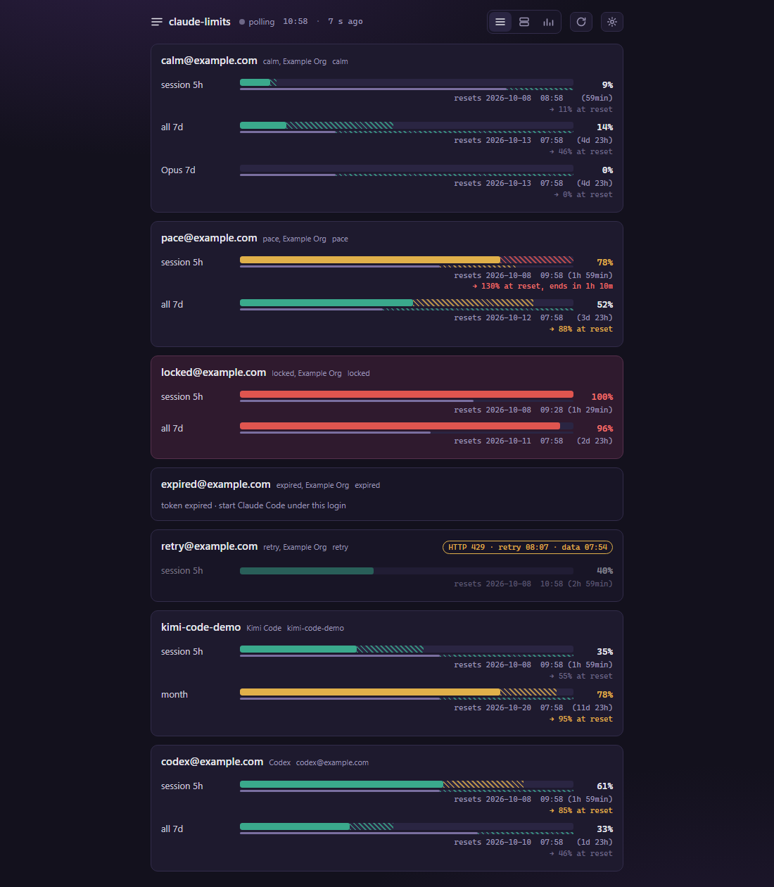

# claude-limits

Usage limits of several Claude accounts on one page: a small local backend you
open in the browser. Windows and Linux.

For every Claude Code login on the machine it shows the same numbers that
`/usage` shows inside Claude Code: the 5-hour session window, the 7-day window
(all models and per model), when each resets, and whether the account is
currently locked. All accounts side by side, without switching logins.

Kimi Code and Codex (OpenAI / ChatGPT) logins are shown on the same page, next
to the Claude ones, each card marked with its service.

## What the page shows



All names and numbers in the picture are made up (`scripts/readme_shot.py` draws it).
Each card is one account; each row is one limit window.

| what you see | what it means |
|---|---|
| **thick bar**, green / yellow / red | the share of the limit already used; yellow from 70%, red from 90% (`[thresholds]`) |
| **hatching at the end of the thick bar** | where the current pace lands by the reset, e.g. `-> 46% at reset`; green below 80%, yellow from 80%, red from 95% (`[forecast]`). Over 100% the quota runs out before the window does; between 80% and 100% it only comes close |
| **thin line under the bar** | how much of the window has passed; compare it with the bar: the bar ahead of the line means you spend faster than time goes |
| **hatching on the thin line** | how far into the window the quota lasts at the current pace: green if it reaches the reset (95% of the window or more), yellow from 80%, red if it ends earlier |
| **`resets ... (2h 10min)`** | when the window starts over, and how long that is |
| **red card, 100%** | locked: the limit is reached, the account waits for the reset |
| **faded rows and a `HTTP 429` badge** | the server asked to wait; the last good reading stays on screen, dated |
| **a card with only a message** | no reading: the login's token has expired (`start Claude Code under this login`) or the answer was rejected |
| **`Kimi Code` / `Codex` next to the name** | the service of that login; Claude cards show the organisation instead |

The `session 5h` row is the five-hour window, `all 7d` the weekly window over all
models, `Opus 7d` a weekly window for one model, `month` the monthly window of Kimi Code
and of a free Codex plan.

## Why

Claude Code keeps one login per config directory. With several accounts
(`CLAUDE_CONFIG_DIR=...` per account) the only way to see remaining quota is to
open a session under each of them and type `/usage`.

The reference for this project is
[claude-usage-widget](https://github.com/niccolo-sabato/claude-usage-widget).
It differs in three ways: it reads Claude Code's own OAuth tokens instead of a
browser session key, it shows several accounts at once instead of switching
between them, and it runs on Linux as well as Windows.

## How it gets the data

### Accounts

A Claude Code login is a config directory with two files:

| file | what is read | notes |
|---|---|---|
| `.claude.json` | `oauthAccount.emailAddress`, `displayName`, `organizationName`, `profileFetchedAt` | identity, shown as the row label; inside the dir and beside it — the freshest profile wins, so a re-logged directory is not labelled by its stale identity |
| `.credentials.json` | `claudeAiOauth.accessToken`, `expiresAt`, `subscriptionType`, `rateLimitTier` | `expiresAt` is milliseconds since the epoch |

Two layouts exist:

- **default**: the directory is `~/.claude` (`%USERPROFILE%\.claude` on
  Windows) and `.claude.json` sits *beside* it, not inside;
- **`CLAUDE_CONFIG_DIR`**: both files live *inside* the named directory. Several
  such directories under one parent are a multi-account setup.

Discovery: the default directory, `CLAUDE_CONFIG_DIR` if set, and every
directory the user lists in the tool's own config (or every child of a
parent directory). macOS keeps tokens in the Keychain and is out of scope.

### Endpoint

```
GET https://api.anthropic.com/api/oauth/usage
Authorization: Bearer <accessToken>
anthropic-beta: oauth-2025-04-20
```

Both headers are required: the OAuth token goes in `Authorization: Bearer`,
never in `x-api-key`. The response is JSON; the useful part is `limits[]`:

| field | meaning |
|---|---|
| `kind` | `session` (5 h), `weekly_all` (7 d, all models), `weekly_scoped` (7 d, one model) |
| `percent` | utilization, 0-100 |
| `severity` | `normal`, `warning`, ... |
| `resets_at` | ISO-8601 with offset |
| `is_active` | whether this window is the one currently limiting |
| `scope.model.display_name` | model name for `weekly_scoped` |

`five_hour` and `seven_day` carry the same numbers as `utilization` +
`resets_at` plus a `locked_reason` when the account is blocked. `extra_usage`
and `spend` describe paid usage above the plan.

This endpoint is the one Claude Code's `/usage` command uses. It is not in the
public platform documentation and may change without notice. The documented
Admin API (`GET /v1/organizations/rate_limits`) needs an organization admin
key and does not apply to a subscription login.

### Token lifetime

`accessToken` lives for hours. Claude Code refreshes it while a session runs
and rewrites `.credentials.json`. The tool therefore re-reads the file before
every request and never caches a token. An expired token is never sent (the
server would answer 401, then 429 to the whole machine).

**The tool still never refreshes a Claude token itself: `refreshToken` is Claude
Code's, and stays untouched.** What it does instead, since 2026-09-16, is start
Claude Code under that config directory and ask it for one tiny answer -- and
Claude Code rewrites its own credentials. The distinction is the design, not a
formality: a second writer of that file would race the first one.

Kimi Code is the deliberate exception: its CLI is not necessarily installed
where this tool runs (unlike `claude`, which the refresher requires), so an
expired Kimi login is renewed by calling the OAuth `refresh_token` grant
(`auth.kimi.com/api/oauth/token`) directly and rewriting the credentials file
atomically (tmp + rename, the same discipline the Kimi CLI uses). Only when
`auto_refresh` is on; `--no-auto-refresh` covers both kinds.

The verdict is the file's mtime, not an exit code. A run that succeeded on a
token which was still valid rewrites nothing, and is reported as `unchanged`
rather than as a refresh.

A refresh costs one small request on that account's own limits, so:

- only logins that BLOCK a reading are renewed (`refresh_all_expired = true`
  takes the other choice);
- one directory is retried at most once an hour (`refresh_cooldown_sec`), because
  a revoked login fails forever and would otherwise cost a request every cycle;
- `--offline` renews nothing: that mode promises no request leaves the machine;
- `auto_refresh = false` in the config, or `--no-auto-refresh`, turns it off and
  brings back the old behaviour -- report the stale login and leave it alone.

By hand: `python scripts/refresh_token.py <dir>` or `--all`
(`scripts\refresh-token.ps1` is a wrapper over it).

## Rules

- A token leaves the machine only towards the service it belongs to:
  `api.anthropic.com` for Claude, the Kimi Code API for Kimi, `chatgpt.com` for
  Codex. It is never logged, never displayed, never written anywhere.
- The tool never writes into Claude Code's directories ITSELF. Auto-refresh is
  not an exception to that: it starts Claude Code, which writes its own files.
  The tool reads one thing from `.credentials.json` besides the token it sends --
  the file's mtime, to tell a refresh from a no-op.
- The local HTTP server listens on `127.0.0.1` only unless you bind it to the
  network on purpose, and then only with an access token: the page shows
  e-mails and organisation names. Tokens never appear in any response.
- Polling is slow (a minute by default); the numbers change slowly and the
  endpoint is not ours.

## Install

There are no prebuilt binaries yet; the tool is built from source with the
[Nova](https://nv-lang.org) toolchain. On Windows (Linux cannot link the database
yet -- see below):

Keep the three checkouts side by side -- `nova/`, `nova-duckdb/` and this
repository in one parent directory; `./nova.sh` finds the compiler there. Elsewhere,
set `NOVA_MAIN_REPO` to the root of the nova checkout (the directory holding
`nova-cli/`), and give `nova.override.toml` an absolute path.

1. Build the `nova` compiler (Rust 1.85+) from `nv-lang/nova` at the commit named
   by `NOVA_REF` in `.github/workflows/ci.yml` or newer (`cd nova/nova-cli && cargo
   build --release`), and Boehm GC (`vcpkg install bdwgc:x64-windows-static`).
2. Build the database library once: check out `nv-lang/nova-duckdb` at `v0.2.2`
   with submodules and run `scripts/build-duckdb.ps1` (40-60 minutes the first
   time; Visual Studio 2022 and LLVM are needed).
3. In this repository, point `duckdb` at that checkout in a `nova.override.toml`
   (never committed):

   ```toml
   [replace]
   duckdb = { path = "../nova-duckdb" }
   ```

4. `./nova.sh build src/claude_limits.nv -o target/claude-limits.exe` -- about two
   minutes the first time (the runtime libraries are built once), under a minute
   after. Warnings from the dependencies (`[new-then-cap]` in nova-compress) are
   expected.

`./nova.sh` runs a copy of the compiler (in `target/nova-bin/`), never the binary in
the `nova` checkout, so a rebuild of the compiler is never blocked by a build here.
The CI workflow (`.github/workflows/ci.yml`) is the same recipe, step by step.

## Run

The binary is `target/claude-limits.exe`; below it is called `claude-limits`.
`--serve` runs until Ctrl+C.

```
claude-limits --serve                  # the page at http://127.0.0.1:7391
claude-limits --serve --config D:/x.toml
claude-limits --once                   # one table in the terminal, no server
claude-limits --install-autostart      # start --serve at login; --uninstall-autostart undoes it
claude-limits forget work@example.org  # delete everything stored about one account
```

`forget` removes the account's readings, windows, polls and its address in the
settings history, then rewrites the database file so the deleted rows are not
left in its bytes, and takes a fresh backup. Backups taken before it still hold
the address: the command says how many there are and leaves them to you. Stop a
running `--serve` first -- the file is replaced.

A second copy on the same port refuses to start and says so. A settings file
that asks for the network (`allow_lan = true`) is refused at the start: listening
beyond `127.0.0.1` is not built yet.

## Configuration

One TOML file, `claude-limits.toml`. The page's settings panel writes it; you can
edit it by hand while the tool is stopped. Where things live:

| | Windows | Linux |
|---|---|---|
| settings | `%APPDATA%\claude-limits\claude-limits.toml` | `$XDG_CONFIG_HOME/claude-limits/` (`~/.config/...`) |
| database key | beside the settings, `claude-limits.key` | the same |
| database | `%LOCALAPPDATA%\claude-limits\claude-limits.duckdb` | `$XDG_DATA_HOME/claude-limits/` (`~/.local/share/...`) |
| backups | `backup\` beside the database | the same |
| log | `%LOCALAPPDATA%\claude-limits\logs\` | `$XDG_STATE_HOME/claude-limits/` |

Overrides, strongest first: `--config <file>` (the key follows the settings file),
`CLAUDE_LIMITS_CONFIG`, `CLAUDE_LIMITS_DATA` or `[storage] data_dir`,
`CLAUDE_LIMITS_DB_KEY_FILE`. **Portable mode:** put a `claude-limits.toml` beside
the binary and everything -- settings, key, database -- lives beside it.

The minimum is the folders that hold logins:

```toml
[[folders]]
path = "D:/accounts"      # a Claude login directory, or a folder of them

[[folders]]
path = "~/.kimi-code"     # a Kimi Code home

[[folders]]
path = "~/.codex"         # a Codex home (auth.json)

[server]
port = 7391
```

The list of folders is read again every round: a folder added in the settings (or
by editing the file) gives its accounts on the next round, and a removed one takes its
logins off the page. The history already in the database stays.

## Pin the browser window

The page is an ordinary web page. To keep it as a small window of its own, open
it as an app window of a Chromium browser:

```
msedge --app=http://127.0.0.1:7391
chrome --app=http://127.0.0.1:7391
```

## Backups and the key

The database is encrypted (AES-GCM) with the key in `claude-limits.key`, created
on the first start. **Keep the key**: without it the history cannot be read, and
nothing can recover it. The settings are unaffected -- they are plain TOML.

A backup is written to `backup\` before every schema migration (the last five are
kept, `[storage] backups_keep`). A backup is ciphertext too and opens only with
the same key, which is NOT copied into `backup\` -- back the key up separately. To
restore, stop the tool and copy a backup over `claude-limits.duckdb`.

## Status

**The Nova binary runs** (`--serve`): it finds the logins, asks the endpoint
every `[poll] interval_sec` (five minutes by default), serves the page, and writes
every round to its encrypted database -- the readings, the lock periods, and which
login sat in which folder -- which `/api/history` and the statistics views read.
Once a day it rolls up and drops what is older than `[history] keep_days` and takes
the weekly backup. TLS trusts the operating system's certificate store first (so a
TLS-inspecting antivirus with its own root works); the start says which source it
loaded. What is not here yet: the page's live stream (`/api/events`) sends the
current snapshot and closes, so the page refreshes by polling and shows `polling`
rather than `live`.

Codex works in the Nova binary too (plan [01.7](docs/plans/01.7-codex.md)): a
folder holding `auth.json` is a Codex login, asked at
`chatgpt.com/backend-api/wham/usage`. The access token is never renewed (see
below), and a free plan shows one `month` window.

A path with non-ASCII characters (a Cyrillic user name, say) works since the Nova
runtime reads the command line and the environment as UTF-8 (nova `2488a47be`; the
probe that pinned the old behaviour is `probes/windows-args-env-ansi/`).

`scripts/claude_limits.py` is a stdlib-only reference for the data path:
it discovers config directories and prints one row per account and window, once
or as a daemon (a snapshot every five minutes by default).

Accounts are listed in `claude-limits.toml` in the repository root (gitignored,
it names your logins); copy `claude-limits.example.toml` and edit:

```toml
interval_sec = 300
accounts = [{ dir = "~/.claude", kind = "claude" },                 # individual dirs
            { dir = "D:/accounts", kind = "claude", children = true }, # every child dir
            { dir = "~/.kimi-code", kind = "kimi" },               # a Kimi Code home
            { dir = "~/.codex", kind = "codex" }]                  # a Codex home
```

`kind` is mandatory: `claude` looks for `.credentials.json`, `kimi` for
`credentials/*.json`, `codex` for `auth.json`, `auto` accepts any of them.
Without a config file the tool falls back to `~/.claude`, `CLAUDE_CONFIG_DIR`,
`~/.kimi-code` (`KIMI_CODE_HOME`) and `~/.codex` (`CODEX_HOME`).

Codex is read-only: the access token in `auth.json` lives about ten days and is
**never renewed by this tool**, because OpenAI's refresh token is single-use and a
renewal that did not reach the file would sign the Codex CLI out. An expired
Codex login is reported with advice to start Codex once; the tool picks the new
token up on the next cycle. Windows are named by length: a free plan shows one
`month limit`, a paid one `5h limit` and `weekly limit`. Directories on the command line override the config
(implicit `auto`). Python 3.11+.

Every limit row carries a progress bar, `[████░░░░]`, the filled part
coloured green, yellow or red by severity. The whole account header line is
highlighted: green when the token works and the numbers are fresh, red when
the token is expired or rejected, yellow when the server or network failed.
`--color always|never` overrides colour; `NO_COLOR` is honoured; a log file
gets no escape codes.

**If the bar looks empty** (`[            ]`), the terminal is not drawing the
block characters `█`/`░`. Two fixes, in order:

1. In VS Code, set `"terminal.integrated.gpuAcceleration": "off"` (Settings ->
   search "terminal gpu"), or pick a terminal font that has block glyphs
   (`"terminal.integrated.fontFamily": "Cascadia Code"` / `Consolas`). This is
   a rendering issue in the terminal, not in the tool.
2. Or keep the terminal as is and use `--bar-style ascii` (or `bar_style =
   "ascii"` in the config) for a `[####....]` bar, which any font draws.

Directories holding the same account (same e-mail) are shown as one group
and asked for once: the endpoint answers HTTP 429 to eager callers, so the
tool also never polls more often than once a minute and, on a 429, waits the
`Retry-After` the server names before the next snapshot.
The real tool is written in [Nova](https://nv-lang.org): one binary that runs
a local backend — it polls the endpoint, serves a page with the bars at
`http://127.0.0.1:7391`, and pushes updates over Server-Sent Events. It can
also install itself to start at login (`--install-autostart`, undone with
`--uninstall-autostart`).

A desktop widget — an always-on-top window with a tray icon, built on SDL3 —
is designed and NOT in the first release: it costs a vendored C dependency and
a topmost matrix across four desktop environments, and the page in the browser
does the same job. The design is kept rather than dropped; see phase Ф.3 of the
plan. The Python script stays as the reference the Nova build is diffed
against. The plan, with phases and acceptance criteria, is
[docs/plans/01-widget-on-nova.md](docs/plans/01-widget-on-nova.md) (Russian).

```
python scripts/claude_limits.py                                      # one snapshot, accounts from the config
python scripts/claude_limits.py --daemon                             # every interval_sec, Ctrl+C to stop
python scripts/claude_limits.py --daemon --interval 60
python scripts/claude_limits.py C:/accounts/nv-lang  # explicit dirs instead of the config
python scripts/claude_limits.py --parent C:/accounts # every child dir instead of the config

.\scripts\start-daemon.ps1              # Windows: daemon in this console
.\scripts\start-daemon.ps1 -Detached    # hidden, output to claude-limits.log; prints the PID to stop
```

## Roadmap

- [x] reference script: discovery (default dir, `CLAUDE_CONFIG_DIR`, configured list, parent dir), same-account grouping, 429 backoff, daemon mode
- [x] Nova core: same table as the script, byte-for-byte (`--once`)
- [ ] local backend: `/api/snapshot`, `/api/events` (SSE), embedded page with one bar per account per window -- done but for the live SSE stream (the page polls instead)
- [x] history: every round is recorded in the encrypted database (readings, lock periods, which login sat in which folder), and `/api/history` serves it by account or by folder, over 24 h / 7 d / 30 d; the statistics views read it
- [ ] threshold notifications
- [ ] after the first release: optional widget (`--widget`) — always-on-top window and tray icon on Windows and Linux (StatusNotifier)

## License

MIT OR Apache-2.0, at your option. See [LICENSE](LICENSE).
